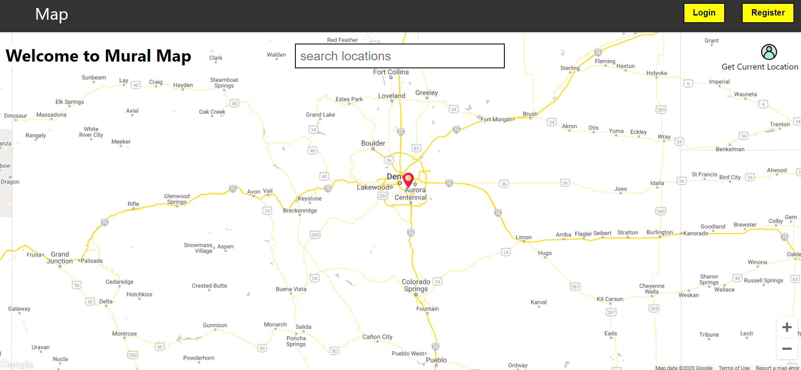

# Mural Map

Mural Map is a full stack MERN application that allows users to find and discover murals. Using an interactive map with markers, the user can find murals that other users discovered and added to the database

## Demo The App

[Click Here](https://muralmap.art/) to view the application on heroku (mobile device preferred)
Live Credentials:

-   email: example@example.com
-   password: password

## Tools and Technologies

-   Node
-   Express
-   React
-   Next
-   MongoDB
-   Mongoose
-   Json Web Tokens
-   Google Maps Geocoding
-   Cloudinary
-   Multer
